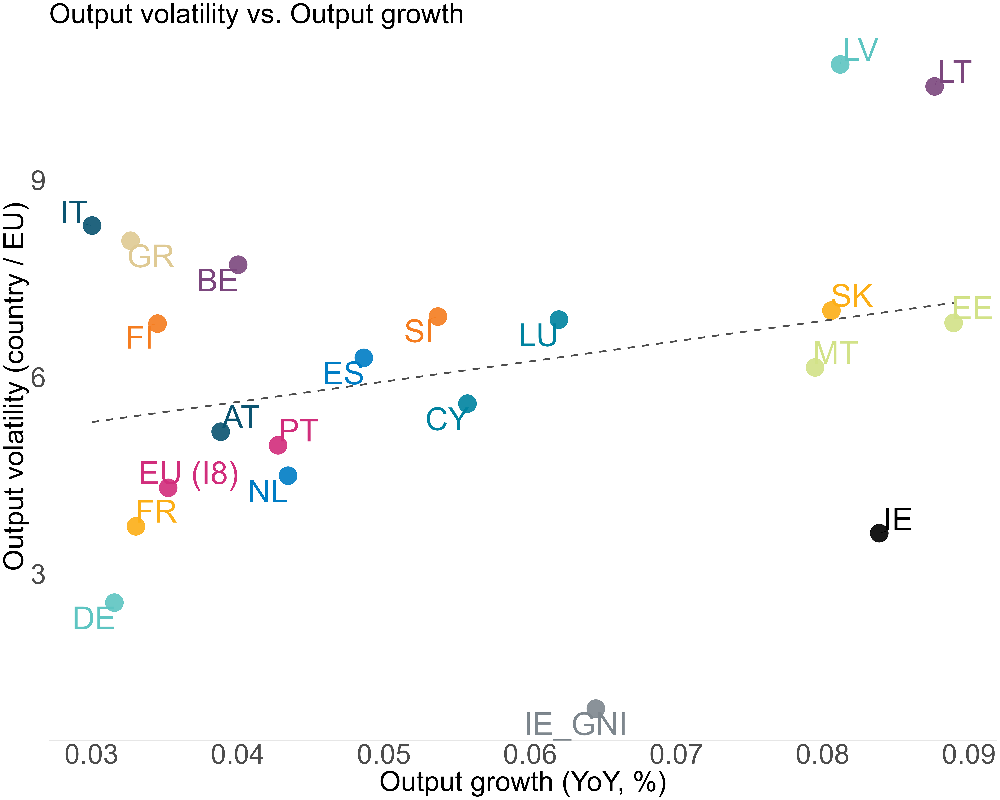

# 📊 Reproducible Code for the Assesment  
**Box __: Output volatility Dynamics**  
Published in: *Financial Stability Report, Central Bank of X*, Quarter [q], Year [yyyy]  

# 💻 📑 Code Authors  
This repository and all accompanying code were produced by:
- **Dr. Farah Mugrabi** (Université catholique de Louvain)

# 📬 Correspondence  
- 📧 [farah.mugrabi@uclouvain.be](mailto:farah.mugrabi@uclouvain.be)  
- 🌐 [www.farahmugrabi.com](http://www.farahmugrabi.com)  

# 🧠 About  
- This repository contains **fully reproducible codes** for the assessment above. 

# 📈 Results  
- Output files are automatically saved in the `B.Results/Plots` folder.
- Main results are reported in the scatter plots.
- Additional figures are descriptive and used to document the underlying data patterns.

# 📊 Main Chart

# 📦 Requirements 
- Code tested under **R version 4.5.1 (2025-06-13 ucrt)**.  
- Please install the required R packages: install.packages(c("dplyr","lubridate","DisaggregateTS","zoo","csodata","ggplot2","ecb","openxlsx","stringr","writexl", "forecast","countrycode", "ggrepel"))

# 📂 Download & Structure  
Please download the following folders and scripts. The files and directories are the following:
- Output_volatility.R (master)
- ECB_get_data.R (utils)
- Data/Series_Keys.xlsx and Data/Data_pre.xlsx

# ⚙️ Instructions:
1. Download the full folder, do not change the location of the files or names.
2. Follow @ to locate configurable options.
3. Run ▶️ the scripts in the following order:
  - Output_volatility.R
5. Notes 📝:

#Methodological Note:
The scatter plot shows the relationship between the average year-on-year growth rate, on the x-axis, and the standard deviation of year-on-year growth rates, on the y-axis. The sample covers the period from 1999Q1 to 2025Q1, excluding the quarters corresponding to the COVID-19 period (observations between 2020-01-01 and 2021-01-01).¹

Footnote:
Data: (1) Demand: Total final domestic demand from the ECB. For Ireland, Modified Final Domestic Demand from the CSO. (2) Investment: Gross fixed capital formation, total – all activities, quarterly. (3) Output: Gross domestic product at market prices, Euro area 20 (fixed composition). All series are expressed in real terms, deflated with the monthly HICP overall index. The HICP was converted to quarterly frequency using the simple average within each quarter, specific to each country. EU (I8) corresponds to the Euro Area 19 countries average.
